# MLBTI (enjoy MLB Together with Interest)

📆 **프로젝트 진행기간 : 2022/08/22 ~ 2022/10/07**
🏆 **SSAFY 특화 프로젝트 수상** 
😎 **BE: 김동우(팀장), 박찬호**
😆 **FE: 이동근, 배송윤, 정민지**


## ✨소개

### 기록의 스포츠, 야구. 그 안에서 또 다른 즐거움을 찾다 "MLBTI"

##### **날씨, 투구 시간, 타율, 역대 전적 등 MLB 경기 중에 쌓인 수많은 데이터를 활용하여 경기를 예측합니다.** 

**이에 그치지 않고, 역대 MLB 선수들로 이루어진 자신만의 팀을 만들어 실제 팀과 경기할 수 있는 시뮬레이션 서비스를 제공합니다.**


## 💡주요기능

- MLB stats API의 데이터를 활용하여 MLB 경기를 시뮬레이션 합니다.
  실제 경기 결과와 저희 서비스의 예측 결과를 비교하여 신뢰성을 높입니다.  

- 나만의 팀을 만들어 실제 MLB 팀과 시뮬레이션으로 경기를 진행 할 수 있습니다.
- MLB (American, National League) 팀과 선수들의 상세 정보를 알 수 있습니다. 


## 🎞MLBTI 서비스 설명

### 1. 메인 화면

___

- #### 경기 시뮬레이션

  - 오늘의 주요 경기 시뮬레이션 진행
  - 어제, 오늘 경기 결과 및 일정 조회 
  - 팀 순위 조회 

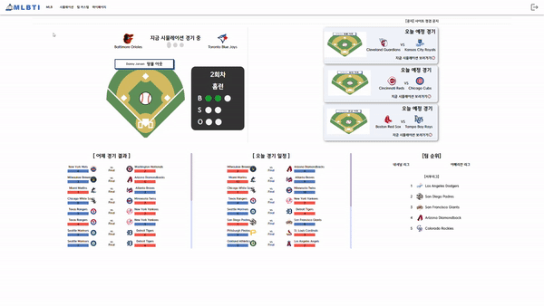

### 2. 나만의 팀 만들기

____

- #### 선수 추가 

  - 시즌, 리그, 소속팀, 포지션 별 MLB 선수 목록 필터링 

  - 선수 추가 시 그라운드에 표시

- #### 팀 설정

  - 선수 별 타순 설정
  - 선수 삭제 

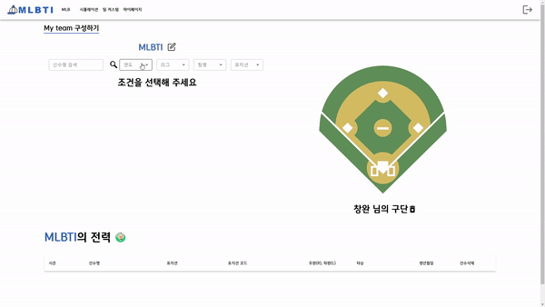


### 3. 시뮬레이션 

___

- #### 커스텀 시뮬레이션 

  - 직접 MLB 팀을 선택하여 시뮬레이션 결과 조회 가능


- #### 실제 경기 시뮬레이션 

  - 메인화면에서 어제 및 오늘의 경기 클릭 시, 두 팀의 시뮬레이션 결과 조회 가능

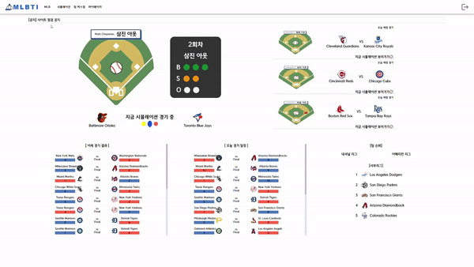


### 4. 마이 페이지

___

- #### 정보 변경

  - 이메일 인증 후 닉네임, 비밀번호 변경 가능

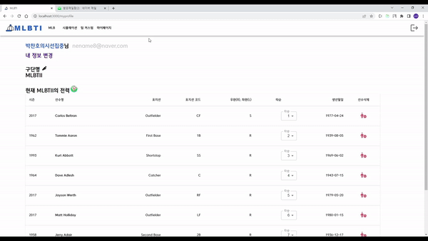

- #### 선수 상세 페이지

  - 커스텀 팀 선수들의 상세 정보 조회 가능

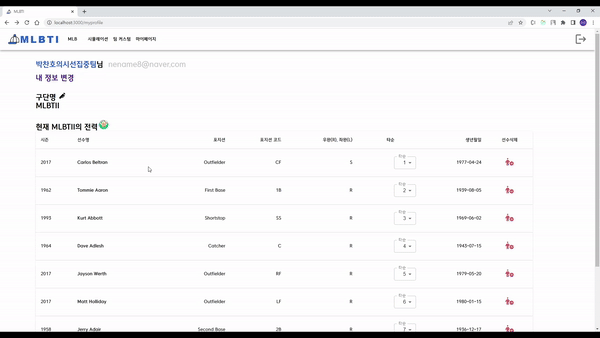


## 🍀개발환경

⌨ Backend

| 기술 스택   | 버전      |
| :---------- | --------- |
| OpenJDK     | 1.8.0_192 |
| Spring boot | 2.4.5     |
| QueryDSL    | 4.4.0     |
| Docker      | 20.10.17  |
| NginX       | 1.18.0    |
| Jenkins     | 2.346     |
| Gradle      | 6.9       |
| Airflow     | 2.23      |

🖥 Frontend

| 기술 스택         | 버전     |
| :---------------- | :------- |
| React             | 18.2.0   |
| NodeJS            | 16.15.0  |
| Redux             | 4.1.2    |
| styeld-components | 5.3.5    |
| stompjs           | 2.3.3    |
| yarn              | 1.22.19  |
| Prettier          | (v9.9.0) |


## 🧱서비스 아키텍쳐


## 🎇기술 특이점

- 정제한 Data를 활용하여 **직접 타석 시뮬레이션**을 구현
  10월 5일에 진행 된 16개 경기에 대해 [실제 경기 결과]와 [시뮬레이션 결과]가 **70%** **일치**

  ```
  *시뮬레이션 로직 설명*
  '우투수 A선수'와 '좌타자 B선수'의 타석을 예측할 때, 
  A선수의 우수투 상대 데이터, B선수의 좌타자 상대 데이터를 활용. 
  이를 바탕으로 타자의 타율, 안타/아웃 분류 데이터, 투수 방어율 데이터 등으로 해당 타석의 예상 결과를 도출하는 방식
  ```

- 빅 데이터

  1900~2022 년 MLB 경기 데이터, 역대 MLB 팀 및 선수 데이터 등 방대한 양의 데이터를 활용하여 시뮬레이션 및 'MLBTI' 서비스를 구축 

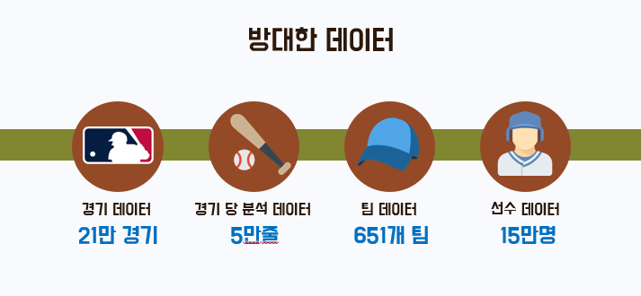

- AirFlow 활용

  MLBTI 서비스는 최신의 데이터를 유지하는 것이 중요.
  데이터를 효율적으로 업데이트 및 모니터링 하기 위해 AirFlow를 활용.

  경기기록은 5분에 한 번, 타자와 투수 데이터는 3일에 한 번씩 갱신하는 스케줄러를 사용 

  

## 👨‍👩‍👦‍👦협업 툴

- Jira

스프린트 기간을 일주일로 설정하여 1주일 작업 내역 정리 
Epic : Ex) 구현, 설계 
Story :  EX) 메인페이지 팀 순위 설계와 같이 Issue를 세분화 하여 스프린트를 운영   


- GItLab

Front와 Back을 나누었고, Git branch, Commit 전략에 맞게 코드 버전 관리

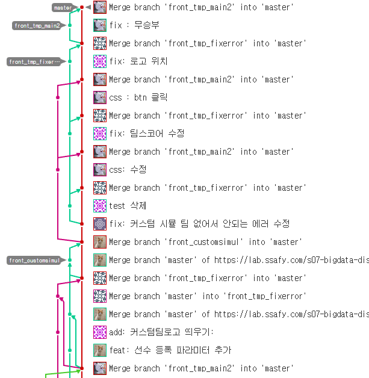


- Notion

스케줄, 레퍼런스, 커밋전략 등 팁 협업에 필요한 내용 정리 및 공유

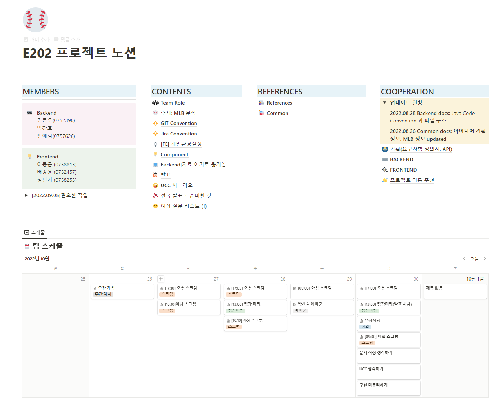


- Swagger UI

Front와 Back 의 원활한 협업을 위해 UI가 우수한 Swagger UI 사용

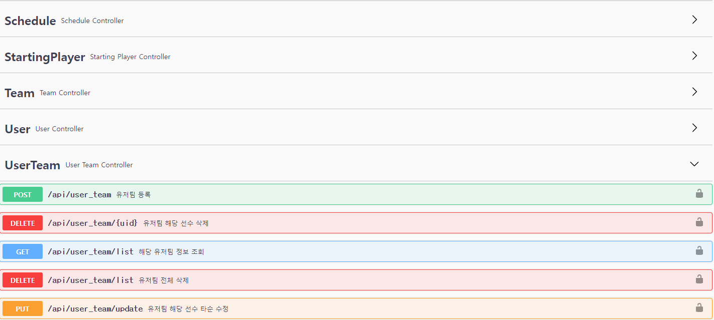


- Figma

프로젝트 구현 전 목업 작성

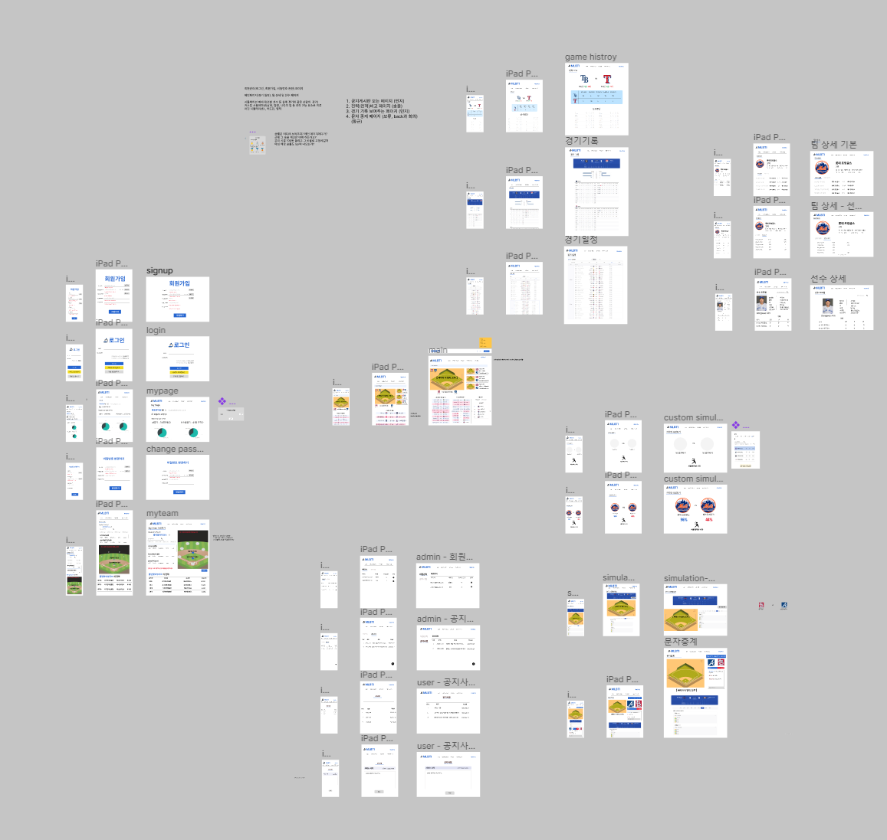

## 👨‍🏫요구사항 정의서

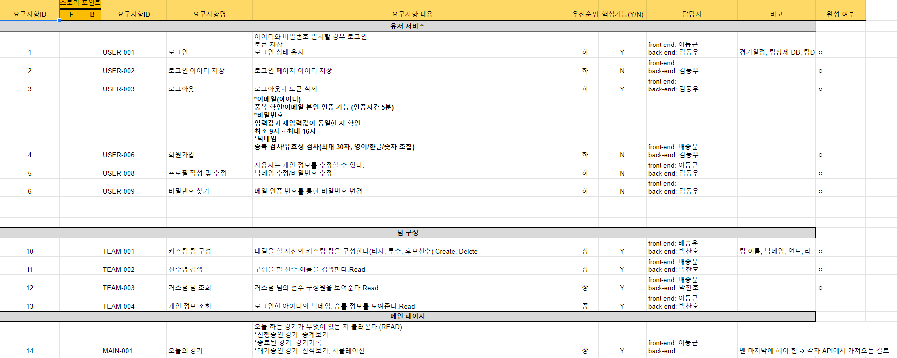


## 🌤컨벤션

#### - Git 컨벤션

___

- Git 브랜치 전략

```
master : 기준이 되는 브랜치로 제품을 배포하는 브랜치
develop : 개발 브랜치로 개발자들이 이 브랜치를 기준으로 각자 작업한 기능들을 Merge
feature : 단위 기능을 개발하는 브랜치로 기능 개발이 완료되면 develop 브랜치에 Merge
release : 배포를 위해 master 브랜치로 보내기 전에 먼저 QA(품질검사)를 하기위한 브랜치
hotfix : master 브랜치로 배포를 했는데 버그가 생겼을 떄 긴급 수정하는 브랜치
```


- Git Commit 전략

```
feat: 새로운 기능
fix: 버그 고친 것
docs: documentation 변경
style: 코드 변경은 없이 띄어쓰기와 같은 코드 스타일 변경 등
refactor: 코드 리팩토링
test: test code 추가, production code는 변경 없음
chore: build test 업데이트

- Code 관련
    - Add : 코드나 문자 추가
    - Test : 테스트 코드 삽입
    - Update : Fix와 달리 원래 정상적으로 동작한 기능의 보완 개념
    - Fix : 버그 수정
    - Remove : 코드 삭제
    - Refactor : 결과의 변경 없이 코드 구조 재조정
                    Ex) createStore의 함수를 작은 함수로 분리
    - Move : 코드나 파일의 이동
    - Style : 서식, 세미콜론 누락
    - Correct : 문법 오류, 타입 및 변수 이름 변경 등 수정 사항에 사용
    
- 기능 관련
    - Feat : 새로운 기능 추가
    - Improve : 호환성, 테스트 커버리지(테스트 케이스가 얼마나 충족 한지), 접근성 향상
    - Chore : 기타 작업, 빌드 작업, 패키지 관리자 구성 등 업데이트, Production Code 변경 없음
    - Test : git 관련 테스트 혹은 코드 관련 테스트 진행
    
- 파일, 폴더 관련
    - Docs : 문서 변경 (문서 추가, 이름 변경 등)
    - Move : 코드나 파일의 이동
    - Rename : 이름 변경
    - Create : 파일이나 폴더 추가
```

#### - Jira 컨벤션

```
Epic : [담당역할] 큰 틀의 단위 업무
	   ex) [FB] 화면 설계 
Story : [담당역할] 세부 업무
		ex) [F] 로그인 화면 설계, [B] 커스텀 팀 등록 API 설계
```


## 🧬ERD


## ✒기타 포팅 자료

[하둡 설치 및 word count 실행 따라하기](참고자료\[BE] 하둡 설치 및 word count 실행 따라하기)

 [포팅 정리](참고자료/[FB] 포팅 자료)